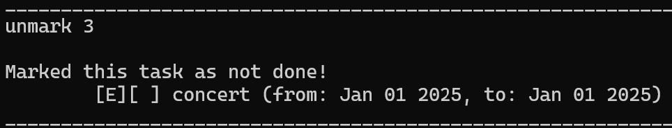
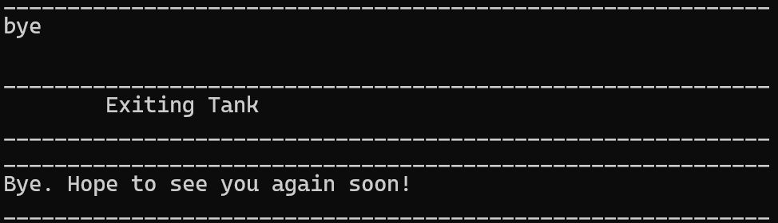

# Tank User Guide

Tank is a CLI-based desktop app for managing your tasks.
You can create three types of tasks: Todo, Deadline, and Event.
Tasks can be viewed at any time, marked as done or undone, and even searched easily.
All data is stored locally and automatically saved, then reloaded when you start the app again.

Enjoy!
 

## Quick start
1) Ensure you have Java 17 or above installed in your Computer.

2) Download the latest .jar file from [here](https://github.com/Tanjy55/ip/releases/tag/).

3) Copy the file to the folder you want to use as the home folder for running Tank.

4) Open a command terminal, cd into the folder you put the jar file in, and use the java -jar Tank.jar command to run the application.

5) Type the command in the command box and press Enter to execute it. e.g. typing help and pressing Enter will open the help window.

Refer to the features below for more details!
 

## Features
 

### Adding Todo

Adds a todo task to the list. Command word Todo is not case-sensitive.

Format: todo <description>

Examples: 
> Todo water plants  
> Todo Clean the windows

Expected output example:

 

### Adding Deadlines

Adds a deadline task to the list. Command word Deadline is not case-sensitive.

Format: deadline <description> /by <DD/MM/YYYY HHMM>

Examples:
> deadline submit assignment /by 05/06/2023 2359  
> deadline quiz /by 15/12/2024 1100

Expected output example:

 

### Adding Events

Adds a todo task to the list. Command word event is not case-sensitive.

Format: event <description> /from <DD/MM/YYYY HHMM> /to <DD/MM/YYYY HHMM>

Examples:
> event computer fair /from 07/08/2024 0800 /to 10/08/2024 1800  
> event concert /from 01/01/2025 1900 /to 01/01/2025 0000

Expected output example:

 

### Viewing all tasks

View all tasks added sequentially. Command word list is not case-sensitive.

Format: list

Example and expected output:

 

### Delete Task

Removes a task from the list. Command word delete is not case-sensitive.

Format: Delete <number shown in list>

Example:
> delete 1  
> delete 3

Expected output:

 

### Marking tasks as 'done'

Simply marks task as done. Command word Mark is not case-sensitive.
Then, use list command to view updated list.

Format: Mark <number shown in list>

Example:
> mark 1  
> mark 3

Expected output:

 

### Marking tasks as 'not done'

Simply marks task as not done. Command word Unmark is not case-sensitive.

Format: Unmark <number shown in list>

Example:
> unmark 1  
> unmark 3

Expected output:

 

### Searching for tasks using keyword

Finds all tasks whose description contains the keyword. 
Both command word find, and keyword are not case-sensitive.

Example:
> find quiz  
> find window

Expected output:

 

### Help!

Should you need a quick reminder, simply type in any random word.

Example and expected output:

 

### Exiting 

Say "bye" to exit. The command word bye is not case-sensitive.

Example and expected output:

 

### Saving the data
Data is saved in the same folder as ip.jar automatically after any command that changes the data. 
The data is stored in `storage.txt`, and there is no need to save manually.

